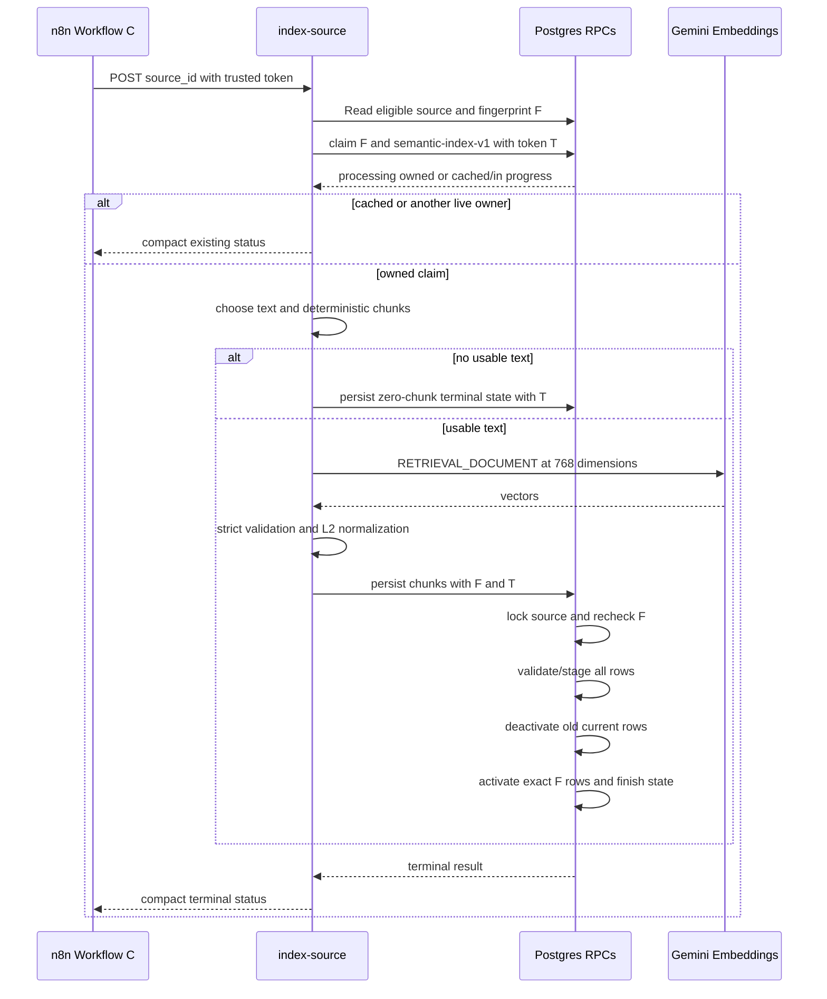

# Phase 7 Semantic Indexing — Design Specification

## 1. Scope and invariants

Phase 7 adds Workflow C: an eligible stored source is deterministically chunked, embedded with Gemini, and atomically published as retrieval-current chunks. It does not perform OCR, infer a festival year, use an LLM for chunking, or delete audit history.

Normative invariants:

- Text precedence is non-empty trimmed `normalized_text`, then non-empty trimmed `raw_text`.
- Retrieval-eligible source statuses are exactly `active`, `updated`, and `postponed`.
- A source must exist and have a non-empty `content_fingerprint`.
- `sources.festival_year` remains authoritative. No `festival_year` column is added to `source_chunks`: this avoids a denormalized value becoming stale. Exact-year retrieval continues to join `sources`; SQL equality naturally excludes a null year.
- An explicit test artifact is a source whose `source_metadata.acceptance` or `source_metadata.test` is JSON boolean `true`. It is ineligible in production. The live acceptance path may process only exact `indexing-test-*` fixtures when separately authorized.
- No usable text plus a non-empty `media_urls` array becomes `needs_review` with `image_only_source_requires_ocr`; no usable text and no media becomes `no_text`. Neither invokes Gemini.
- `semantic-index-v1` identifies the complete chunking/embedding contract. Change it whenever chunking, whitespace normalization, embedding model, output dimensions, or vector normalization changes.
- Chunk identity is UUIDv5 over `source_id:source_fingerprint:indexer_version:chunk_index`. Model is omitted because a model change requires a version bump.
- Current chunks are switched source-locally in one database transaction. Historical rows remain immutable audit evidence.

## 2. Migration and schema design

Create `supabase/migrations/009_semantic_indexing.sql`. The SQL below is the implementation contract. Schema qualification and explicit grants are mandatory.

### 2.1 `source_indexings`

```sql
CREATE TABLE public.source_indexings (
  id UUID PRIMARY KEY DEFAULT gen_random_uuid(),
  source_id UUID NOT NULL REFERENCES public.sources(id) ON DELETE CASCADE,
  source_fingerprint TEXT NOT NULL CHECK (btrim(source_fingerprint) <> ''),
  indexer_version TEXT NOT NULL CHECK (btrim(indexer_version) <> ''),
  embedding_model TEXT NOT NULL CHECK (btrim(embedding_model) <> ''),
  embedding_dimensions INTEGER NOT NULL CHECK (embedding_dimensions = 768),
  status TEXT NOT NULL DEFAULT 'pending' CHECK (status IN (
    'pending','processing','indexed','no_text','needs_review',
    'retryable_error','permanent_error'
  )),
  attempt_count INTEGER NOT NULL DEFAULT 0 CHECK (attempt_count >= 0),
  chunk_count INTEGER NOT NULL DEFAULT 0 CHECK (chunk_count >= 0),
  review_reasons TEXT[] NOT NULL DEFAULT '{}'::TEXT[],
  last_error_code TEXT,
  last_error_message TEXT,
  claim_token UUID,
  lease_expires_at TIMESTAMPTZ,
  started_at TIMESTAMPTZ,
  completed_at TIMESTAMPTZ,
  created_at TIMESTAMPTZ NOT NULL DEFAULT NOW(),
  updated_at TIMESTAMPTZ NOT NULL DEFAULT NOW(),
  CONSTRAINT source_indexings_identity_unique
    UNIQUE (source_id, source_fingerprint, indexer_version),
  CONSTRAINT source_indexings_claim_shape CHECK (
    (status = 'processing' AND claim_token IS NOT NULL AND lease_expires_at IS NOT NULL)
    OR
    (status <> 'processing' AND claim_token IS NULL AND lease_expires_at IS NULL)
  ),
  CONSTRAINT source_indexings_terminal_shape CHECK (
    (status = 'indexed' AND chunk_count > 0 AND cardinality(review_reasons) = 0)
    OR (status = 'no_text' AND chunk_count = 0 AND cardinality(review_reasons) = 0)
    OR (status = 'needs_review' AND chunk_count = 0 AND cardinality(review_reasons) > 0)
    OR (status IN ('pending','processing','retryable_error','permanent_error'))
  )
);

CREATE INDEX idx_source_indexings_source_latest
  ON public.source_indexings (source_id, created_at DESC);
CREATE INDEX idx_source_indexings_status_updated
  ON public.source_indexings (status, updated_at);
CREATE INDEX idx_source_indexings_reclaimable
  ON public.source_indexings (lease_expires_at)
  WHERE status = 'processing';

CREATE TRIGGER update_source_indexings_updated_at
  BEFORE UPDATE ON public.source_indexings
  FOR EACH ROW EXECUTE FUNCTION public.update_updated_at_column();

ALTER TABLE public.source_indexings ENABLE ROW LEVEL SECURITY;
CREATE POLICY "Service role full access for source_indexings"
  ON public.source_indexings FOR ALL
  USING (auth.role() = 'service_role')
  WITH CHECK (auth.role() = 'service_role');
```

The unique key intentionally excludes model and dimensions. A claim using an existing version with different model/dimensions fails with `indexer version configuration mismatch`; this forces the required version bump rather than creating colliding chunk identities.

### 2.2 `source_chunks` evolution

Backfill deployed rows before applying non-null constraints. Existing chunks are treated as valid legacy Gemini 768-dimensional output and remain current until Phase 7 replaces them.

```sql
ALTER TABLE public.source_chunks
  DROP CONSTRAINT IF EXISTS unique_source_chunk;

ALTER TABLE public.source_chunks
  ADD COLUMN source_fingerprint TEXT,
  ADD COLUMN indexer_version TEXT,
  ADD COLUMN embedding_model TEXT,
  ADD COLUMN embedding_dimensions INTEGER,
  ADD COLUMN content_hash TEXT,
  ADD COLUMN is_current BOOLEAN NOT NULL DEFAULT TRUE,
  ADD COLUMN superseded_at TIMESTAMPTZ,
  ADD COLUMN updated_at TIMESTAMPTZ NOT NULL DEFAULT NOW();

UPDATE public.source_chunks sc
SET source_fingerprint = s.content_fingerprint,
    indexer_version = 'legacy-pre-phase7',
    embedding_model = 'gemini-embedding-001',
    embedding_dimensions = 768,
    content_hash = encode(digest(sc.content, 'sha256'), 'hex')
FROM public.sources s
WHERE s.id = sc.source_id;

-- Abort migration rather than invent provenance if any orphan/null backfill remains.
DO $$ BEGIN
  IF EXISTS (
    SELECT 1 FROM public.source_chunks
    WHERE source_fingerprint IS NULL OR content_hash IS NULL
  ) THEN RAISE EXCEPTION 'source_chunks provenance backfill failed'; END IF;
END $$;

ALTER TABLE public.source_chunks
  ALTER COLUMN source_fingerprint SET NOT NULL,
  ALTER COLUMN indexer_version SET NOT NULL,
  ALTER COLUMN embedding_model SET NOT NULL,
  ALTER COLUMN embedding_dimensions SET NOT NULL,
  ALTER COLUMN content_hash SET NOT NULL,
  ADD CONSTRAINT source_chunks_chunk_index_nonnegative CHECK (chunk_index >= 0),
  ADD CONSTRAINT source_chunks_content_nonempty CHECK (btrim(content) <> ''),
  ADD CONSTRAINT source_chunks_fingerprint_nonempty CHECK (btrim(source_fingerprint) <> ''),
  ADD CONSTRAINT source_chunks_indexer_version_nonempty CHECK (btrim(indexer_version) <> ''),
  ADD CONSTRAINT source_chunks_embedding_model_nonempty CHECK (btrim(embedding_model) <> ''),
  ADD CONSTRAINT source_chunks_embedding_dimensions_768 CHECK (embedding_dimensions = 768),
  ADD CONSTRAINT source_chunks_content_hash_sha256 CHECK (content_hash ~ '^[0-9a-f]{64}$'),
  ADD CONSTRAINT source_chunks_current_shape CHECK (
    (is_current AND superseded_at IS NULL) OR
    (NOT is_current AND superseded_at IS NOT NULL)
  ),
  ADD CONSTRAINT source_chunks_identity_unique
    UNIQUE (source_id, source_fingerprint, indexer_version, chunk_index);

CREATE UNIQUE INDEX uq_source_chunks_one_current_position
  ON public.source_chunks (source_id, chunk_index)
  WHERE is_current;
CREATE INDEX idx_source_chunks_current_source
  ON public.source_chunks (source_id, is_current);

CREATE TRIGGER update_source_chunks_updated_at
  BEFORE UPDATE ON public.source_chunks
  FOR EACH ROW EXECUTE FUNCTION public.update_updated_at_column();
```

The existing IVFFlat cosine index remains. A later scale-driven migration may replace it with a partial current-only index after measuring planner behavior; correctness does not depend on that optimization.

Update `search_source_chunks` without changing its public signature or result shape. Add `sc.is_current`, `sc.embedding IS NOT NULL`, and `s.is_current` predicates, retain exact source status/year filtering, and harden its path:

```sql
CREATE OR REPLACE FUNCTION public.search_source_chunks(
  query_embedding extensions.vector(768),
  target_festival_year INT,
  match_threshold FLOAT DEFAULT 0.7,
  match_count INT DEFAULT 10
) RETURNS TABLE (
  chunk_id UUID, source_id UUID, chunk_index INT, content TEXT,
  similarity FLOAT, source_platform TEXT, source_published_at TIMESTAMPTZ,
  source_festival_year INT, source_status TEXT,
  source_supersedes_source_id UUID
) LANGUAGE sql STABLE PARALLEL SAFE
SET search_path = pg_catalog, public, extensions AS $$
  SELECT sc.id, sc.source_id, sc.chunk_index, sc.content,
    1 - (sc.embedding OPERATOR(extensions.<=>) query_embedding),
    s.platform, s.published_at, s.festival_year, s.status, s.supersedes_source_id
  FROM public.source_chunks sc
  JOIN public.sources s ON s.id = sc.source_id
  WHERE sc.is_current
    AND sc.embedding IS NOT NULL
    AND s.is_current
    AND s.festival_year = target_festival_year
    AND s.status IN ('active','updated','postponed')
    AND 1 - (sc.embedding OPERATOR(extensions.<=>) query_embedding) > match_threshold
  ORDER BY sc.embedding OPERATOR(extensions.<=>) query_embedding
  LIMIT match_count;
$$;
```

### 2.3 RPCs

#### Claim

```sql
public.claim_source_indexing(
  p_source_id UUID,
  p_source_fingerprint TEXT,
  p_indexer_version TEXT,
  p_embedding_model TEXT,
  p_embedding_dimensions INTEGER,
  p_claim_token UUID,
  p_lease_seconds INTEGER DEFAULT 120
) RETURNS public.source_indexings
```

Precise body contract:

```sql
LANGUAGE plpgsql SECURITY DEFINER
SET search_path = pg_catalog, public SET timezone = 'UTC' AS $$
DECLARE v_row public.source_indexings;
BEGIN
  IF p_claim_token IS NULL OR p_lease_seconds < 30 OR p_lease_seconds > 300
     OR NULLIF(btrim(p_source_fingerprint), '') IS NULL
     OR NULLIF(btrim(p_indexer_version), '') IS NULL
     OR NULLIF(btrim(p_embedding_model), '') IS NULL
     OR p_embedding_dimensions <> 768
  THEN RAISE EXCEPTION 'invalid indexing lease or configuration'; END IF;

  INSERT INTO public.source_indexings (
    source_id, source_fingerprint, indexer_version,
    embedding_model, embedding_dimensions, status
  ) VALUES (
    p_source_id, p_source_fingerprint, p_indexer_version,
    p_embedding_model, p_embedding_dimensions, 'pending'
  ) ON CONFLICT (source_id, source_fingerprint, indexer_version) DO NOTHING;

  SELECT * INTO v_row FROM public.source_indexings
  WHERE source_id = p_source_id
    AND source_fingerprint = p_source_fingerprint
    AND indexer_version = p_indexer_version
  FOR UPDATE;

  IF v_row.embedding_model <> p_embedding_model
     OR v_row.embedding_dimensions <> p_embedding_dimensions
  THEN RAISE EXCEPTION 'indexer version configuration mismatch'; END IF;

  IF v_row.status IN ('indexed','no_text','needs_review','permanent_error')
  THEN RETURN v_row; END IF;
  IF v_row.status = 'processing' AND v_row.lease_expires_at > clock_timestamp()
  THEN RETURN v_row; END IF;

  UPDATE public.source_indexings
  SET status = 'processing',
      attempt_count = attempt_count + 1,
      chunk_count = 0,
      review_reasons = '{}',
      claim_token = p_claim_token,
      lease_expires_at = clock_timestamp() + make_interval(secs => p_lease_seconds),
      started_at = clock_timestamp(), completed_at = NULL,
      last_error_code = NULL, last_error_message = NULL
  WHERE id = v_row.id RETURNING * INTO v_row;
  RETURN v_row;
END; $$;
```

`retryable_error`, `pending`, and expired `processing` rows are claimable. Completed states and unexpired work are returned without ownership. `permanent_error` is cached for the same version; remediation requires a corrected source fingerprint or bumped indexer version.

#### Persist

```sql
public.persist_source_indexing(
  p_indexing_id UUID,
  p_claim_token UUID,
  p_source_id UUID,
  p_source_fingerprint TEXT,
  p_indexer_version TEXT,
  p_embedding_model TEXT,
  p_embedding_dimensions INTEGER,
  p_status TEXT,
  p_chunks JSONB,
  p_review_reasons TEXT[] DEFAULT '{}'::TEXT[]
) RETURNS JSONB
```

`p_chunks` is a JSON array of `{chunk_index, content, content_hash, embedding}`. The function executes one transaction implicitly and follows this body contract:

1. Accept only `indexed`, `no_text`, or `needs_review`.
2. Lock `sources[id = p_source_id] FOR UPDATE`; require current fingerprint to equal `p_source_fingerprint`.
3. Lock the indexing row; require exact identity/configuration, `processing`, matching token, and an unexpired lease.
4. Require a JSON array. For `indexed`, require one or more elements and no review reasons. For `no_text`, require zero elements/reasons. For `needs_review`, require zero elements and one or more reasons.
5. Validate every array member before mutating current rows: contiguous zero-based unique indexes; non-empty content; lowercase SHA-256 equal to `encode(digest(content,'sha256'),'hex')`; embedding JSON array length exactly 768; every element JSON-number and finite after cast; L2 norm within `1 ± 1e-5`; and deterministic UUID computed by `public.uuid_generate_v5(public.uuid_ns_url(), p_source_id::text || ':' || p_source_fingerprint || ':' || p_indexer_version || ':' || chunk_index)`.
6. Insert all new rows with `is_current = FALSE` and a non-null temporary `superseded_at = clock_timestamp()` using `ON CONFLICT (source_id, source_fingerprint, indexer_version, chunk_index) DO UPDATE`, but only permit an exact replay: existing ID, content, hash, model, dimensions, and embedding must match. Any mismatch raises `non-deterministic indexing replay`.
7. For `indexed`, verify inserted/existing row count equals the input count.
8. Deactivate prior current chunks for this source with `is_current = FALSE`, `superseded_at = clock_timestamp()`, excluding the exact new identity. Then activate all exact new rows with `is_current = TRUE`, `superseded_at = NULL`.
9. For `no_text` or `needs_review`, deactivate all current chunks for the source and insert none. This terminal zero-chunk commit is the successful replacement: it prevents stale prior text from remaining retrievable after an edit removes text.
10. Update state to the terminal status, persisted chunk count, review reasons, completion time, clear claim/error fields, and return `jsonb_build_object('status', p_status, 'persisted_chunks', count, 'cached', false)`.

Representative loop and vector checks:

```sql
FOR v_chunk, v_ordinality IN
  SELECT value, ordinality
  FROM jsonb_array_elements(p_chunks) WITH ORDINALITY
LOOP
  v_index := (v_chunk->>'chunk_index')::INTEGER;
  IF v_index <> v_ordinality - 1 THEN RAISE EXCEPTION 'non-contiguous chunk indexes'; END IF;
  IF jsonb_typeof(v_chunk->'embedding') <> 'array'
     OR jsonb_array_length(v_chunk->'embedding') <> 768
  THEN RAISE EXCEPTION 'invalid embedding dimensions'; END IF;
  IF EXISTS (
    SELECT 1 FROM jsonb_array_elements(v_chunk->'embedding') e
    WHERE jsonb_typeof(e) <> 'number'
  ) THEN RAISE EXCEPTION 'malformed embedding'; END IF;
  v_embedding := (v_chunk->'embedding')::TEXT::extensions.vector(768);
  IF abs(sqrt(-1 * (v_embedding <#> v_embedding)) - 1.0) > 0.00001
  THEN RAISE EXCEPTION 'embedding is not normalized'; END IF;
  -- Validate content/hash and stage the exact deterministic row.
END LOOP;
```

The implementation should use a PL/pgSQL exception block around numeric/vector casts to convert cast failures into `malformed embedding`, and a transaction-local temporary table or validated arrays so no current-row update occurs before all input has passed validation.

#### Fail

```sql
public.fail_source_indexing(
  p_indexing_id UUID,
  p_claim_token UUID,
  p_status TEXT,
  p_error_code TEXT,
  p_error_message TEXT
) RETURNS VOID
LANGUAGE plpgsql SECURITY DEFINER
SET search_path = pg_catalog, public SET timezone = 'UTC' AS $$
BEGIN
  IF p_status NOT IN ('retryable_error','permanent_error')
  THEN RAISE EXCEPTION 'invalid indexing error status'; END IF;
  UPDATE public.source_indexings
  SET status = p_status,
      last_error_code = left(COALESCE(p_error_code, 'unknown'), 100),
      last_error_message = left(COALESCE(p_error_message, 'unknown indexing error'), 2000),
      completed_at = clock_timestamp(), claim_token = NULL, lease_expires_at = NULL
  WHERE id = p_indexing_id
    AND status = 'processing'
    AND claim_token IS NOT DISTINCT FROM p_claim_token
    AND lease_expires_at > clock_timestamp();
  IF NOT FOUND THEN RAISE EXCEPTION 'invalid or expired indexing claim'; END IF;
END; $$;
```

An expired worker cannot overwrite a reclaimed worker's state. Failure never changes chunks.

#### Grants

```sql
REVOKE ALL ON FUNCTION public.claim_source_indexing(UUID,TEXT,TEXT,TEXT,INTEGER,UUID,INTEGER)
  FROM PUBLIC, anon, authenticated;
REVOKE ALL ON FUNCTION public.persist_source_indexing(UUID,UUID,UUID,TEXT,TEXT,TEXT,INTEGER,TEXT,JSONB,TEXT[])
  FROM PUBLIC, anon, authenticated;
REVOKE ALL ON FUNCTION public.fail_source_indexing(UUID,UUID,TEXT,TEXT,TEXT)
  FROM PUBLIC, anon, authenticated;
GRANT EXECUTE ON FUNCTION public.claim_source_indexing(UUID,TEXT,TEXT,TEXT,INTEGER,UUID,INTEGER) TO service_role;
GRANT EXECUTE ON FUNCTION public.persist_source_indexing(UUID,UUID,UUID,TEXT,TEXT,TEXT,INTEGER,TEXT,JSONB,TEXT[]) TO service_role;
GRANT EXECUTE ON FUNCTION public.fail_source_indexing(UUID,UUID,TEXT,TEXT,TEXT) TO service_role;
REVOKE ALL ON public.source_indexings FROM PUBLIC, anon, authenticated;
GRANT ALL ON public.source_indexings TO service_role;
```

### 2.4 Review view

```sql
CREATE OR REPLACE VIEW public.indexing_review_queue
WITH (security_invoker = true) AS
SELECT
  i.id AS indexing_id,
  i.source_id,
  s.post_id,
  s.post_url,
  s.source_type,
  s.media_urls,
  s.festival_year,
  i.source_fingerprint,
  i.indexer_version,
  i.embedding_model,
  i.embedding_dimensions,
  i.status,
  i.review_reasons,
  i.attempt_count AS latest_attempt,
  i.last_error_code,
  i.last_error_message,
  i.created_at,
  i.updated_at
FROM public.source_indexings i
JOIN public.sources s ON s.id = i.source_id
WHERE i.status IN ('needs_review','retryable_error','permanent_error');

REVOKE ALL ON public.indexing_review_queue FROM PUBLIC, anon, authenticated;
GRANT SELECT ON public.indexing_review_queue TO service_role;
```

## 3. Module and file structure

### `supabase/functions/_shared/embedding.ts`

Single provider boundary used by both chat and indexing:

- Export constants `EMBEDDING_DIMENSIONS = 768`, default model `gemini-embedding-001`, and typed `EmbeddingFailure` metadata.
- `normalizeEmbedding(values, expectedDimensions = 768)`: require an actual array of exactly 768 finite numbers. Do not truncate or pad. Compute norm with a stable sum, reject zero/non-finite norm, normalize, then verify every output is finite and unit norm within tolerance.
- `generateQueryEmbedding(text, options)`: reject blank text; call `embedContent` with `taskType: 'RETRIEVAL_QUERY'` and `outputDimensionality: 768`; normalize strictly.
- `generateDocumentEmbeddings(texts, options)`: reject empty input/blank members; preserve input order; call Gemini with `taskType: 'RETRIEVAL_DOCUMENT'`. Prefer `batchEmbedContents` in bounded batches (for example 20), validating response count and each vector. If the API/client contract does not support batch reliably, bounded sequential `embedContent` calls are acceptable; do not use unbounded concurrency.
- `classifyEmbeddingError(error)`: return `{status, code, safeMessage, httpStatus?}` without source text, vectors, provider body, URL keys, or secrets.
- Inject `fetch`, API key, model, timeout signal, attempts, and sleep in options so unit tests are network-free.
- Own 3 total attempts, delays 250 ms then 500 ms plus bounded nondeterministic-free scheduling delay (no jitter is required), and one hard invocation deadline. Retry only classified transient failures.

Refactor `supabase/functions/chat/index.ts` to import `normalizeEmbedding` and `generateQueryEmbedding`; preserve query task type and behavior. The current truncation behavior must be removed because a dimension mismatch is now a permanent contract error.

### `supabase/functions/_shared/chunking.ts`

- Export `normalizeSourceText`, `chunkSourceText`, `contentHash`, and constants defining the versioned contract.
- Keep the module pure except SHA-256 hashing; no provider calls, randomness, locale-sensitive segmentation, or wall clock.
- Return ordered `{chunkIndex, content, contentHash}` objects.
- Add colocated `chunking.test.ts`; add `embedding.test.ts` beside the helper for mocked provider tests.

### `supabase/functions/index-source/index.ts`

- Deno Edge Function using repository REST conventions and `SUPABASE_SECRET_KEYS.default` in hosted execution.
- Require POST and exact `{source_id}` payload; reject unknown keys to keep the endpoint narrow.
- Require `x-index-source-token`, compared in constant time against non-empty `INDEX_SOURCE_TOKEN`.
- Read source fields: identity/fingerprint/status/is_current/text, `media_urls`, `source_metadata`, and festival year for status output only.
- Reject explicit acceptance/test metadata unless a separate `INDEXING_ACCEPTANCE_FIXTURE_TOKEN` is configured, differs from the production token, request token matches it, post ID starts `indexing-test-`, and exact compiled fixture metadata/text matches. Never accept caller-provided embeddings.
- Claim before terminal no-text classification so all outcomes are fingerprint/version audited.
- On owned claim: choose text, classify no-text/image-only, chunk, hash, embed, then call atomic persistence. Persistence performs the authoritative fingerprint recheck.
- Return compact bodies only: `{status, source_id, cached, in_progress?, persisted_chunks?, review_reasons?, error?}`.
- Suggested HTTP mapping: 200 for indexed/cached/no_text/needs_review/in-progress; 400 invalid request; 401 unauthorized; 404 source missing; 409 lifecycle/test/fingerprint ineligibility or stale fingerprint; 422 permanent processing failure; 503 retryable failure; 500 server configuration/database-control-plane failure.
- Configure `[functions.index-source] verify_jwt = false` in `supabase/config.toml`; custom token remains the security boundary.

### Tests, workflow, docs, package scripts

- `scripts/semantic-indexing-migration.test.ts`: static migration-chain and security contract checks, matching existing repository style.
- `scripts/semantic-indexing-workflow.test.ts`: parse and inspect inactive Workflow C JSON.
- `scripts/semantic-indexing-live.ts`: guarded production-writing acceptance and separately invoked narrow cleanup.
- `docs/semantic-indexing.md`: operational and security documentation.
- `n8n/workflows/buglasan-semantic-indexer.json`: inactive authenticated webhook → validate → one endpoint call → status switch.
- Add package scripts `indexing:acceptance`, `indexing:cleanup`, and `check:indexing-json`.

## 4. Deterministic chunking contract

Constants for `semantic-index-v1`:

- Target: 1,200 characters.
- Hard maximum: 1,600 characters.
- No overlap.
- A source whose normalized selected text has 1–1,600 characters is one chunk.
- Character counts use JavaScript UTF-16 `string.length`; this is explicitly versioned to avoid cross-runtime ambiguity.

Detailed pseudocode:

```text
normalizeSourceText(input):
  require input is string
  replace CRLF and bare CR with LF
  replace NBSP with ordinary space
  on each line: replace horizontal whitespace runs [tab, form-feed, space] with one space
  trim each line
  replace 3-or-more consecutive LF with exactly 2 LF
  trim whole result
  return result

splitParagraphs(text):
  if empty return []
  split on one-or-more LF
  trim each item and discard empty items
  return items

splitOversizeParagraph(paragraph):
  scan left-to-right with a deterministic regex boundary after . ! ? followed by whitespace
  retain punctuation; trim segments; do not use Intl.Segmenter
  if no sentence boundary, treat entire paragraph as one sentence
  accumulate sentences separated by one space while candidate length <= HARD_MAX
  for any sentence > HARD_MAX:
    repeatedly choose cut <= HARD_MAX
    prefer the last ordinary-space position at or after TARGET * 0.6
    otherwise cut exactly at HARD_MAX
    trim emitted slice and remaining slice
  emit non-empty pieces in original order

chunkSourceText(input):
  text = normalizeSourceText(input)
  if text is empty return []
  if text.length <= HARD_MAX return one chunk containing text
  units = []
  for paragraph in splitParagraphs(text):
    if paragraph.length <= HARD_MAX append paragraph
    else append splitOversizeParagraph(paragraph)
  chunks = []
  current = empty
  for unit in units:
    separator = current is empty ? empty : two LF
    if current is not empty and current.length >= TARGET:
      emit current; current = unit
    else if (current + separator + unit).length <= HARD_MAX:
      append separator + unit to current
    else:
      if current non-empty emit current
      current = unit
  emit final current if non-empty
  assert every chunk length is 1..HARD_MAX
  assign zero-based indexes
  contentHash = lowercase hex SHA-256 of exact UTF-8 chunk content
```

The target is a soft packing threshold: paragraphs are not split merely to hit 1,200, but no output exceeds 1,600. Short text is retained rather than discarded. Whitespace-only text yields no chunks and follows no-text classification.

## 5. State machine and concurrency

### Transitions

- No row → `pending` through insert inside claim.
- `pending` → `processing` on claim.
- `retryable_error` → `processing` on later claim.
- `processing` with expired lease → `processing` under a new token, incrementing attempts.
- `processing` → `indexed` after atomic non-empty replacement.
- `processing` → `no_text` after atomic zero-chunk replacement with no media.
- `processing` → `needs_review` after atomic zero-chunk replacement for image-only media.
- `processing` → `retryable_error` for exhausted transient errors.
- `processing` → `permanent_error` for deterministic/provider-contract errors.
- `indexed`, `no_text`, `needs_review`, and `permanent_error` are terminal/cache hits for the exact source/fingerprint/version/configuration.
- A changed fingerprint or bumped version creates a separate row beginning at `pending`; old state remains audit history.

Lifecycle-ineligible and explicit stale-test sources are rejected before claim because they are not indexing attempts. Missing fingerprint is likewise a source-ingestion invariant failure, not a valid fingerprint-scoped state.

### Lease details

- Default lease: 120 seconds; database accepts 30–300 seconds.
- Function hard timeout must be less than lease (recommended 90 seconds), including all provider attempts and persistence.
- Every processing claim has a random UUID owner token.
- Claim serializes on the unique indexing row with `FOR UPDATE`.
- Persist/fail require the same token and an unexpired lease.
- Reclaimed stale workers cannot persist or fail because their token differs.
- The source row lock and fingerprint recheck make a concurrent source edit abort old work before publication.

### Persistence sequence



### Races addressed

- Duplicate delivery: unique state key returns cached terminal output with zero embedding calls and zero inserts.
- Concurrent first delivery: row lock grants one token; loser sees live `processing` and performs no Gemini call.
- Worker crash: lease expiration permits reclaim.
- Old worker after reclaim: token and expiry checks reject persist/fail.
- Source edit during embedding: locked fingerprint recheck rejects commit; old current chunks remain unchanged. The stale run should be failed only if its claim remains valid; otherwise return conflict and allow a new-fingerprint invocation.
- Partial provider or malformed vector batch: no persistence call, or persistence validation aborts transaction; old chunks remain current.
- Persist retry after uncertain network result: deterministic upsert verifies exact content/vector and terminal claim response is subsequently cached.
- Edit to no text/image-only: successful zero-chunk terminal commit deactivates stale old chunks.
- Chunk count shrinks: all old current rows are deactivated, then only the new exact set is activated.

## 6. Error classification

| Condition | Internal retries | Persisted status | Error code | Endpoint HTTP |
|---|---:|---|---|---:|
| Gemini 429 | 3 total attempts | `retryable_error` after exhaustion | `embedding_rate_limited` | 503 |
| Gemini 500, 502, 503, 504 | 3 total attempts | `retryable_error` after exhaustion | `embedding_upstream_unavailable` | 503 |
| Fetch/network `TypeError` | 3 total attempts | `retryable_error` after exhaustion | `embedding_network_error` | 503 |
| Hard timeout/AbortError | bounded by deadline | `retryable_error` | `embedding_timeout` | 503 |
| Gemini 400 | none | `permanent_error` | `embedding_bad_request` | 422 |
| Gemini 401 or 403 | none | `permanent_error` | `embedding_auth_error` | 422 |
| Gemini 404 | none | `permanent_error` | `embedding_model_not_found` | 422 |
| Other Gemini 4xx | none | `permanent_error` | `embedding_request_rejected` | 422 |
| Other non-2xx | none | `permanent_error` | `embedding_unclassified_http` | 422 |
| Missing/non-array response or response count mismatch | none | `permanent_error` | `embedding_malformed_response` | 422 |
| Dimension other than exactly 768 | none | `permanent_error` | `embedding_dimension_mismatch` | 422 |
| Any NaN, Infinity, or non-number | none | `permanent_error` | `embedding_non_finite` | 422 |
| Zero-magnitude vector | none | `permanent_error` | `embedding_zero_vector` | 422 |
| Deterministic replay mismatch | none | `permanent_error` | `non_deterministic_replay` | 422 |
| Source changed before commit | none in old run | no chunk/state overwrite | `stale_source_fingerprint` | 409 |
| Database transport/control-plane transient before known commit | no provider retry | `retryable_error` only if valid claim can be failed | `database_unavailable` | 503 |
| Invalid request/source ID | none | no state | `invalid_request` | 400 |
| Missing/wrong trusted token | none | no state | `unauthorized` | 401 |
| Source absent | none | no state | `source_not_found` | 404 |
| Ineligible lifecycle or explicit production test artifact | none | no state | `source_ineligible` or `stale_test_artifact` | 409 |

Do not retry malformed responses or vector contract failures: they are deterministic incompatibilities and must cause model/version/configuration investigation. Logs include only provider, model, status, retry-after, request ID, attempt, source ID, and safe code—never text, vectors, tokens, keys, or raw provider bodies.

## 7. Test strategy

### Chunker unit tests

In `_shared/chunking.test.ts` verify:

1. Empty and whitespace-only inputs return no chunks.
2. CRLF/CR, tabs, NBSP, repeated spaces, blank lines, and outer whitespace normalize exactly.
3. Short normalized/raw candidate produces one chunk and stable SHA-256.
4. Paragraph accumulation respects order, target behavior, separators, and 1,600 hard max.
5. Oversized paragraphs split at deterministic sentence boundaries.
6. Oversized sentences prefer a late space and hard-cut when no suitable space exists.
7. Punctuation, emoji/surrogate pairs, URLs, and multilingual text remain byte-stable.
8. Repeated calls return byte-identical content, indexes, and hashes.
9. No overlap/duplication and concatenated semantic order is preserved.

### Embedding helper unit tests

In `_shared/embedding.test.ts`, inject mocked fetch/sleep:

1. Query and document requests use their respective task types, configured model, and output dimensionality 768.
2. Response order matches input order across bounded batches.
3. Valid vectors normalize to unit length.
4. Empty input, blank members, malformed shape, count mismatch, dimensions 767/769, non-number, NaN/infinity simulation, and zero vectors reject with exact permanent codes.
5. 429/500/502/503/504 and network errors retry exactly three total attempts with bounded delays.
6. 400/401/403/404 and malformed successful responses do not retry.
7. Abort deadline produces retryable timeout and cancels outstanding fetch.
8. Safe errors/log metadata contain no key, source text, vector, or provider body.
9. Chat imports the shared query helper and retains `RETRIEVAL_QUERY`; index source uses `RETRIEVAL_DOCUMENT`.

### Migration contract test

`scripts/semantic-indexing-migration.test.ts` verifies:

- Ordered migration chain ends in `009_semantic_indexing.sql`.
- All statuses, constraints, unique identities, indexes, backfill, triggers, and exact 768 checks exist.
- Old `(source_id, chunk_index)` constraint is dropped and partial current uniqueness is added.
- All three RPCs are `SECURITY DEFINER` with fixed `search_path`, token/lease/fingerprint checks, source lock, and atomic current switch.
- Search includes `sc.is_current`, authoritative source join/year, current statuses, and no public table read.
- RLS is enabled; PUBLIC/anon/authenticated grants are revoked; service role grants are explicit.
- View is `security_invoker`, service-only, and exposes review diagnostics.
- For stronger DDL confidence, add an optional local Supabase integration test that applies migrations from empty state and introspects `pg_constraint`, `pg_indexes`, `pg_policies`, `information_schema.routine_privileges`, and `information_schema.role_table_grants`. Static text checks alone do not prove SQL applies.

### Endpoint tests

Add `scripts/index-source-function.test.ts` or incorporate equivalent checks into the migration suite:

- Constant-time `x-index-source-token`, hosted secret-key convention, compact responses, no secret leakage.
- Exact source text precedence and lifecycle/test eligibility.
- No-text/image-only paths never invoke embedding.
- Claim ownership precedes work; cached/in-progress paths skip embedding.
- Provider classification, bounded attempts, hard timeout, and persistence RPC arguments.
- Acceptance fixtures are disabled by default, separately authorized, exact-input only, and cannot accept embeddings from the caller.

### Workflow test

`scripts/semantic-indexing-workflow.test.ts` parses Workflow C and asserts:

- `active` is false and export has no secret literal.
- Authenticated webhook uses placeholder Header Auth credentials.
- Input validation accepts exactly a UUID `source_id` before HTTP execution.
- Exactly one HTTP Request node calls `$env.SUPABASE_URL/functions/v1/index-source` with `$env.INDEX_SOURCE_TOKEN` and `neverError=true`.
- Status switch covers `indexed`, `no_text`, `needs_review`, `processing`, `retryable_error`, and `permanent_error`/unexpected failure.
- No retry, loop, collector, extractor, Gemini, or database-write node exists; the Edge Function owns retries and persistence.

### Live acceptance harness — Tests 1–6

Guard with all server variables, exact `SUPABASE_EXPECTED_PROJECT_REF`, and `LIVE_SEMANTIC_INDEXING_TEST=I_UNDERSTAND_THIS_WRITES_TO_PRODUCTION`. Use only `indexing-test-*` sources with explicit acceptance metadata and separate fixture authorization. Scope every audit query by returned source ID.

1. **Normal short text:** one source produces `indexed`, one current chunk, index 0, exact content/hash, 768 finite unit vector, model/version provenance, and deterministic UUID.
2. **Deterministic multi-chunk:** paragraph/oversized input produces expected exact chunk boundaries, contiguous indexes, hashes, and only current rows for its fingerprint.
3. **Null-year temporal integrity:** source festival year null remains null; indexing succeeds; exact-year search never returns its chunks.
4. **No-text/image-only:** textless source without media yields `no_text`; textless source with media yields `needs_review` and exact OCR reason; both have zero Gemini-derived chunks. This is one grouped terminal-classification test.
5. **Replay and concurrency:** unchanged ingest plus repeated endpoint invocation returns cached, creates zero new state/chunk rows, preserves IDs/timestamps, and makes no acceptance embedding fixture call; two simultaneous first calls yield one owner and no duplicate current identity.
6. **Edit replacement and failed replacement:** edit same source to a new fingerprint and verify old chunks stay current while an injected retryable embedding failure occurs; retry successfully and verify exactly the new fingerprint becomes current while old chunks remain non-current audit rows. Also assert stale old worker/token cannot publish.

Cleanup is a separate `--cleanup` mode. It first resolves only sources whose post ID begins `indexing-test-`, verifies every returned row satisfies that invariant, deletes only those exact source IDs, and relies on source cascades for chunks/indexing states. Never use an unscoped delete.

## 8. n8n Workflow C design

Node flow:

1. Inactive Webhook node with Header Auth placeholder receives POST JSON.
2. Validation Code/IF node requires an object with one valid UUID `source_id`; invalid input terminates without endpoint call.
3. HTTP Request node posts `{source_id}` to `$env.SUPABASE_URL/functions/v1/index-source`, sets `x-index-source-token: $env.INDEX_SOURCE_TOKEN`, JSON content type, timeout above the Edge Function deadline, and `neverError=true`.
4. Switch node branches:
   - success/cache: `indexed`, `no_text`;
   - manual review: `needs_review`;
   - already running: `processing` or response `in_progress=true`;
   - externally retryable outcome: `retryable_error` (record/alert only; no nested immediate retry);
   - permanent/unexpected: `permanent_error` or unknown status.
5. Respond-to-Webhook nodes return compact status without credentials/provider details.

Workflow C remains independent from collector and extractor exports. Workflow A or an external orchestrator may invoke it after ingest, but the artifact itself accepts only `source_id`.

## 9. Documentation outline for `docs/semantic-indexing.md`

1. **Purpose and boundary** — Workflow C responsibilities; no OCR/year inference/LLM chunking.
2. **Eligibility and text precedence** — lifecycle states, explicit test metadata, normalized/raw rules, image-only review.
3. **Versioned deterministic chunking** — constants, normalization, split behavior, no overlap, hash and identity formulas.
4. **Embedding contract** — Gemini model/env, 768 dimensions, query versus document task types, strict validation and L2 normalization.
5. **Schema and temporal integrity** — indexing audit rows, chunk provenance/currentness, authoritative joined source year, null-year exclusion.
6. **Atomic replacement and replay** — claim/lease, fingerprint recheck, old-current-until-success, zero-chunk terminal replacement, deterministic replay.
7. **State machine and error policy** — statuses, transitions, retry ownership and classification table.
8. **Security model** — `verify_jwt=false`, constant-time trusted token, service-only RPC/view/table, secret handling and sanitized logs.
9. **Workflow C setup** — inactive import, n8n Header Auth, `$env` variables, status branches, no nested retries.
10. **Configuration and deployment** — `GEMINI_EMBEDDING_MODEL`, Gemini/Supabase/token secrets, migration then function deployment order, mandatory version bump rules.
11. **Local verification** — unit, migration, workflow, typecheck, build, lint, JSON validation commands.
12. **Guarded live acceptance and cleanup** — opt-in, expected project ref, six tests, exact prefix scoping, separate cleanup.
13. **Operations** — review queue triage, retrying transient rows, stale lease recovery, monitoring safe codes, rollback behavior.

## 10. Implementation order

1. Add shared chunking helper and unit tests.
2. Add strict shared embedding helper/tests and refactor chat to it without changing query semantics.
3. Add/apply migration 009 and migration contract/integration tests.
4. Add index-source function, config entry, and endpoint contract tests.
5. Add inactive Workflow C and structural test.
6. Add guarded live harness and package scripts.
7. Add operator documentation and run the complete local verification suite.
8. Deploy only in a separately approved implementation/deployment phase; run guarded acceptance afterward.
